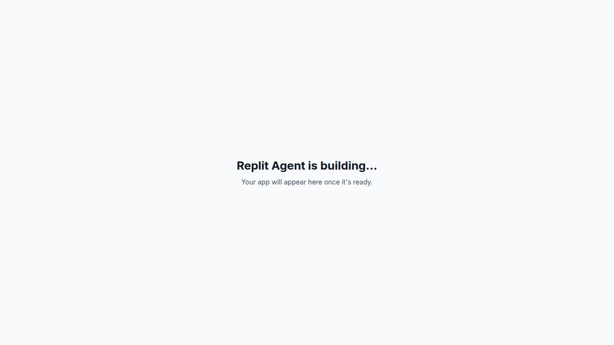

# Bloom Salon



Bloom Salon is a modern salon website built with React and Vite. It presents the brand, services, appointment flow, contact details, and supporting pages in a polished single-page experience with smooth UI motion and responsive layout.

## What’s Included

- Luxury-style landing page with a strong hero section
- Services, gallery, about, reviews, contact, and appointment pages
- Responsive navigation and floating appointment call to action
- Theme support and animated interface elements
- Clean component-based structure for future expansion

## Pages

- Home
- Services
- Gallery
- About
- Reviews
- Contact
- Appointment

## Tech Stack

- React 19
- Vite
- TypeScript
- Tailwind CSS
- Framer Motion
- Wouter
- TanStack React Query
- Radix UI components

## Getting Started

### Prerequisites

- Node.js 18 or newer
- pnpm

### Install Dependencies

```bash
pnpm install
```

### Start Development Server

```bash
pnpm dev
```

The app runs on the local Vite server at `http://localhost:5173/` by default.

### Build for Production

```bash
pnpm build
```

### Preview the Production Build

```bash
pnpm serve
```

## Available Scripts

- `pnpm dev` - start the development server
- `pnpm build` - create a production build
- `pnpm serve` - preview the production build
- `pnpm typecheck` - run TypeScript checks

## Project Structure

```text
src/
  App.tsx
  main.tsx
  index.css
  components/
    layout/
    ui/
  hooks/
  lib/
  pages/
public/
  favicon.svg
  opengraph.jpg
  robots.txt
```

## Notes

- The app uses the `@/` path alias for imports from `src/`.
- The homepage image and metadata are set up for a polished public-facing presentation.
- The repository is organized to stay easy to extend with additional pages or salon features.